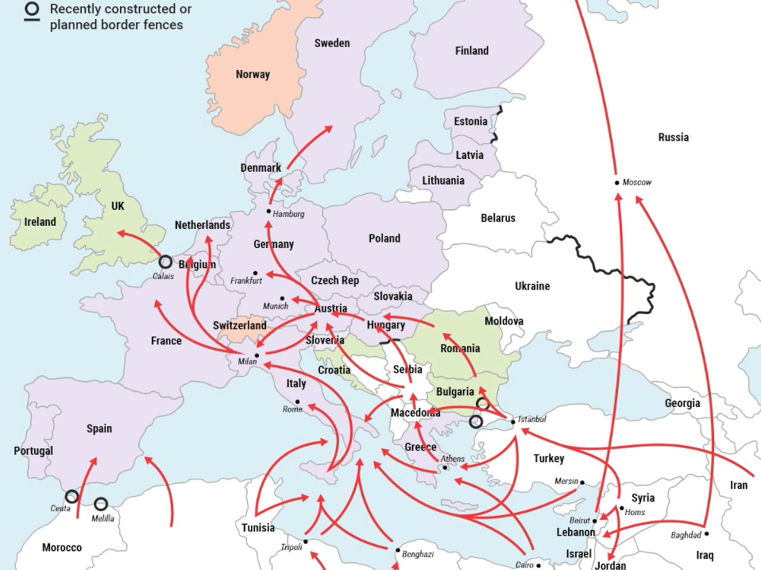

## _Ejemplo de red de refugiados_



```{r, echo=FALSE}
library(ggplot2)
library(data.table)
library(igraph)
```

### Creación de la red 

Nodos = países y enlaces = conexiones entre países.

```{r}
red.refugiados <- graph.formula(UK-FR, FR-NL, FR-GER, FR-SP, NL-GER,
                  GER-DEN,GER-IT, SP-MAROC, SP-IT, IT-TUN, IT-GR,
                  GR-EGY, TUN-EGY, GR-TUR, TUR-SYR)
```

Ancho de los enlaces
```{r}
E(red.refugiados)$width <- 5
```

### Visualización de los enlaces de la red
```{r, fig.width=14, fig.height=12}
E(red.refugiados)
plot(red.refugiados)
```

La **centralidad** (_closeness centrality_) nos da una idea de qué tan importante es un nodo en la red.

La  **intermediación** (_betweenness centrality_) cuantifica que tiene la importancia de cada nodo dentro de la red

```{r}
data.table(Nodo=c("UK", "FR", "NL", "GER", "SP", "DEN",
                  "IT", "MAROC", "TUN", "GR", "EGY",
                  "TUR", "SYR"),
           Cercania = round(closeness(red.refugiados), 3),
           Intermediacion = betweenness(red.refugiados))
```

Italia y Alemania tiene los valores más altos.

Veamos ahora qué sucede si incluimos un pequeño cambio en la red.
Pensemos en que se "cierra" la frontera Grecia - Italia

```{r}
red.refugiados.dos <- graph.formula(UK-FR, FR-NL, FR-GER, FR-SP, NL-GER,
                                GER-DEN,GER-IT, SP-MAROC, SP-IT, IT-TUN,
                                GR-EGY, TUN-EGY, GR-TUR, TUR-SYR)
E(red.refugiados.dos)$width <- 5

```

### Visualización de los enlaces de la red
```{r, fig.width=14, fig.height=12}
E(red.refugiados.dos)
plot(red.refugiados.dos)
```

```{r}
data.table(Nodo=c("UK", "FR", "NL", "GER", "SP", "DEN",
                  "IT", "MAROC", "TUN", "GR", "EGY",
                  "TUR", "SYR"),
           Cercania = round(closeness(red.refugiados.dos), 3),
           Intermediacion = betweenness(red.refugiados.dos))
```


```{r}
data.table(Nodo=c("UK", "FR", "NL", "GER", "SP", "DEN",
                           "IT", "MAROC", "TUN", "GR", "EGY",
                           "TUR", "SYR"),
                    Cercania = round(closeness(red.refugiados), 3),
                    Intermediacion = betweenness(red.refugiados),
                    Cercania2 = round(closeness(red.refugiados.dos), 3),
                    Intermediacion2 = betweenness(red.refugiados.dos))
```


