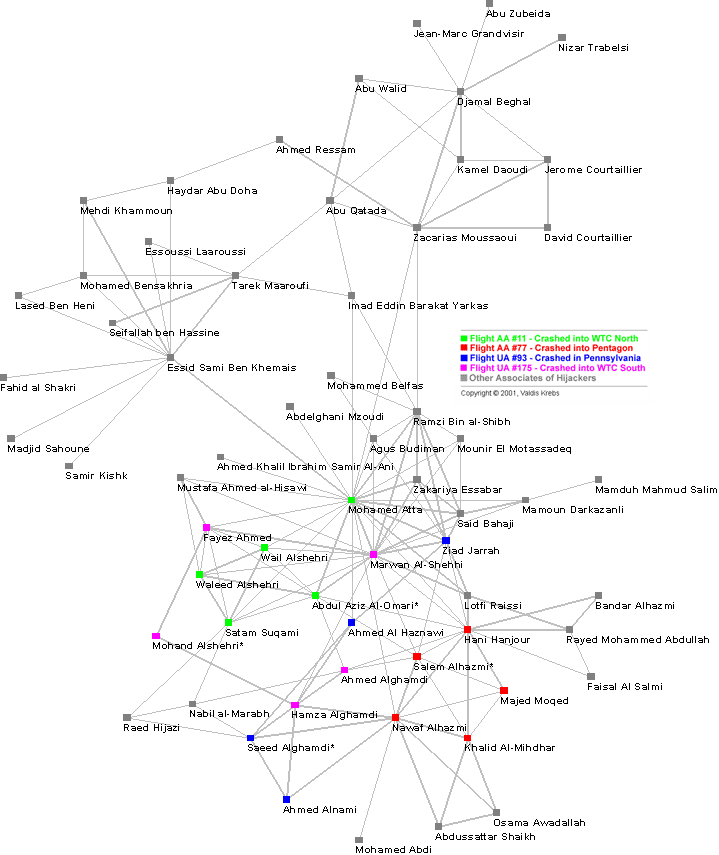
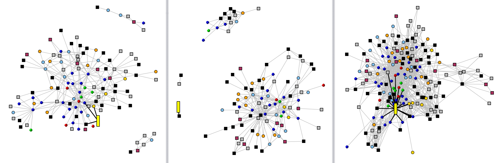
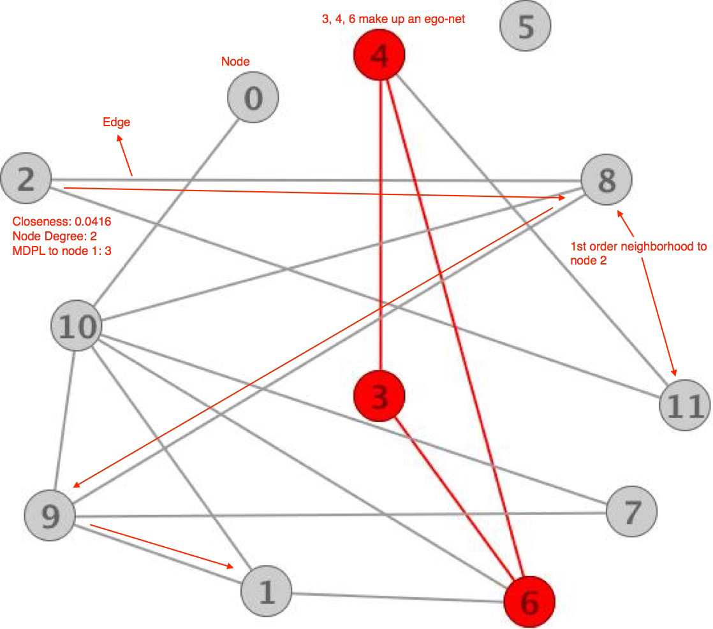
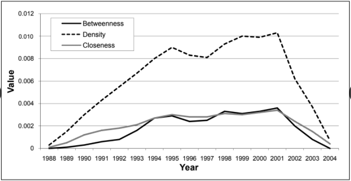

```{r setup, include=FALSE}
options(htmltools.dir.version = FALSE)
```

class: center, middle


## **Presentado por:**

### Martín Andrés Macías Quintero

## **Profesor:**

### José Alberto Vargas Navas, PhD

---
### Contenido

_Objetivos_

1. _Panorama_ 

2. _Introducción al lenguaje de redes_

3. _Métodos de monitoreo_
	- Cartas de control y pruebas de hipótesis
	- Métodos bayesianos
	- Modelos de series temporales
	- Otros enfoques

4. _Algunos problemas en el monitoreo de redes sociales_
	- Fase I vs. Fase II
	- Uso de simulaciones computacionales
	- Supuestos distribucionales

5. _Oportunidades de investigación_

---

## Objetivos

--

1. Dar un panorama de métodos estadísticos para monitorear redes sociales.

--

2. Revisar las ventajas, limitaciones e inconvenientes de los métodos estadísticos usados en monitoreo de redes sociales.

--

3. Presentar la relación entre métodos de monitoreo de redes sociales y procesos industriales (estadísticas en ingeniería y vigilancia en salud pública)

--

4. Alentar a investigadores a desarrollar métodos de monitoreo en redes sociales y compararlos con los tradiciones métodos de monitoreo en procesos industriales.

--

5. Discutir algunos problemas en este campo y presentar algunas ideas de investigación.

---

class: inverse, middle, center

#  Panorama

---
### Introducción

- Creciente interés por investigar el monitoreo de redes sociales

- Métodos de monitoreo de redes sociales que han permitido la detección de:
	- Participantes importantes e influyentes en una red
	- Estructuras organizacionales clandestinas
	- Actividades fraudulentas o destructivas
	
#### _Idea básica:_ 

- Detectar cambios súbitos en el comportamiento de un subconjunto de individuos en una red.
  - Incrementos significativos en los niveles de comunicación de la red completa, de redes más pequeñas o de individuos de interés.
  - Decrementos en niveles de comunicación.
  
#### _Anomalías:_

Regiones de la red con estructura diferente de la esperada bajo condiciones normales.

---
# Análisis de redes sociales

Las **redes sociales** pueden señalar un **cambio** dentro de una organización, e incluso pueden **predecir** eventos o comportamientos significativos.

.footnote[
[1] McCulloh, I., Webb, M., Graham, J., Carley, K., & Horn, D. B. (2008). Change detection in social networks. Military Academy Dept Mathematical sciences. [PDF](http://www.dtic.mil/get-tr-doc/pdf?AD=ADA484611)
]

--

Detectar esos cambios permite 

* la **anticipación** y **advertencia** temprana de cambio y
* **respuesta** inmediata ante el cambio.

--

### _*Procedimiento*_

Aplicar técnicas de **control estadístico de procesos** 
a redes sociales para detectar esos cambios.


---

.center[




.caption[
**Fig. 1:** Ilustración de una red terrorista. Krebs (2002)
]

]
---
class: middle
.center[




.caption[
**Fig. 2:** Ilustración de tres instantáneas de redes de correo electrónico de Enron en 2000 (izquierda), 2001 (centro), 2002 (derecha)
]

]

---
class: inverse, middle, center

# Introducción al lenguaje de redes

---

### Grafos

Las redes o grafos proveen mecanismos matemáticos para modelar los patrones de comunicación entre grupos de individuos.

<center><iframe src="https://giphy.com/embed/fXCEXIA9aWbSg" width="550" height="550" frameBorder="0" class="giphy-embed" allowFullScreen></iframe></center>


---

+ Una **red social observada** se modela mediante un grafo. Los **nodos** representan a las personas y los **enlaces** a las conexiones entre ellos. [1] 

.footnote[[1] (Scott, 2002; Wasserman & Faust, 1994) ]

--

+ Los enlaces pueden ponderarse para resaltar la importancia de la conexión o pueden dirigirse para mostrar quién inicia la conexión y quién la recibe. 

--
.center[




.caption[
**Fig. 3:** Ilustración de una pequeña red con 12 nodos y 16 enlaces.
]

]
---
# Medidas de centralidad de redes

La centralidad es una función que asigna valores numéricos a cada nodo de acuerdo con su influencia en la red sobre los demás individuos.

--
.pull-left[

**Densidad**

Número de enlaces que existen en el grafo dividido por el número total de enlaces posibles.

$$ d = \frac{\text{# enlaces}}{n(n-1)}$$
--

**Centralidad** _(Closeness)_

Cómo se conecta un nodo más allá de sus vecinos más próximos.

$$c_k = \frac{\min_k\{\sum_{i=1}^n g_{ki}\}}{\sum_{i=1}^n g_{ki}}$$

]

--

.pull-right[

**Intermediación** _(Betweenness)_

Con qué frecuencia un nodo se encuentra a lo largo de la ruta más corta, o geodésica, entre otros dos nodos para todos los nodos en un gráfico.

$$b_k = \sum _{i,j} \frac{g_{ikj}}{g_{ij}}$$
+ $g_{ikj}$: número de rutas geodésicas entre los nodos $i$ y $j$ cruzando el nodo $k$.

+ $g_{ij}$: número total de rutas geodésicas entre los nodos $i$ y $j$.

]

---
## Promedios de medidas

<p align="center">
  
</p>

--

**Notas**

+ Puede haber un cambio significativo en la red de al-Qaeda entre los años 2000 y 2001. 

+ Se nos alertaría de un cambio crítico en la red antes de los ataques terroristas del 11 de septiembre.
---
class: center, middle, inverse

# Métodos de monitoreo
---
## Métodos de Cartas de control y pruebas de hipótesis

<style type="text/css">
.tg  {border-collapse:collapse;border-spacing:0;border-width:1px;border-style:solid;border-color:#ccc;}
.tg td{font-family:Arial, sans-serif;font-size:14px;padding:10px 5px;border-style:solid;border-width:0px;overflow:hidden;word-break:normal;border-color:#ccc;color:#333;background-color:#fff;}
.tg th{font-family:Arial, sans-serif;font-size:14px;font-weight:normal;padding:10px 5px;border-style:solid;border-width:0px;overflow:hidden;word-break:normal;border-color:#ccc;color:#333;background-color:#f0f0f0;}
.tg .tg-0ev2{font-style:italic;font-family:Georgia, serif !important;;border-color:#000000;vertical-align:top}
.tg .tg-r16w{background-color:#f9f9f9;font-style:italic;font-family:Georgia, serif !important;;border-color:#000000}
.tg .tg-pvrp{font-weight:bold;font-family:Georgia, serif !important;;border-color:#000000;text-align:center}
.tg .tg-eqkn{background-color:#f9f9f9;font-family:Georgia, serif !important;;border-color:#000000}
.tg .tg-x9k1{background-color:#f9f9f9;font-style:italic;font-family:Georgia, serif !important;;border-color:#000000;vertical-align:top}
.tg .tg-yv9v{font-family:Georgia, serif !important;;border-color:#000000;vertical-align:top}
.tg .tg-rg1e{background-color:#f9f9f9;font-family:Georgia, serif !important;;border-color:#000000;vertical-align:top}
</style>
<table class="tg">
  <tr>
    <th class="tg-pvrp">Artículo</th>
    <th class="tg-pvrp">Perspectiva de monitoreo</th>
  </tr>
  <tr>
    <td class="tg-r16w">Social network change detection</td>
    <td class="tg-eqkn" rowspan="3">Cartas CUSUM y EWMA para detectar cambios en el comportamiento <br>de las comunicaciones en unidades militares.<br>Utilizaron medidas de centralidad de redes.<br>Establecieron que entre 5 más redes deben ser usadas para establecer una línea de base</td>
  </tr>
  <tr>
    <td class="tg-0ev2">Detecting change in human social behavior simulation.</td>
  </tr>
  <tr>
    <td class="tg-x9k1">Detecting change in longitudinal social networks</td>
  </tr>
  <tr>
    <td class="tg-0ev2">Monitoring temporal homogeneity in attributed network streams</td>
    <td class="tg-yv9v">Regresión logística para modelar la probabilidad de conexión entre individuos usando <br>covariables como variables explicatorias para detectar cambios dentro y entre sub-redes específicas.</td>
  </tr>
  <tr>
    <td class="tg-x9k1">Binary response profiles</td>
    <td class="tg-rg1e">Monitoreo de perfiles para determinar cuando el modelo de regresión logística varía en el tiempo</td>
  </tr>
  <tr>
    <td class="tg-0ev2">Efficient anomaly detection in dynamic, attributed graphs</td>
    <td class="tg-yv9v">Modelos log-lineales para probabilidades de conexión entre individuos que permite ahorro computacional.</td>
  </tr>
</table>
---
### Métodos bayesianos

<style type="text/css">
.tg  {border-collapse:collapse;border-spacing:0;border-width:1px;border-style:solid;border-color:#ccc;}
.tg td{font-family:Arial, sans-serif;font-size:14px;padding:10px 5px;border-style:solid;border-width:0px;overflow:hidden;word-break:normal;border-color:#ccc;color:#333;background-color:#fff;}
.tg th{font-family:Arial, sans-serif;font-size:14px;font-weight:normal;padding:10px 5px;border-style:solid;border-width:0px;overflow:hidden;word-break:normal;border-color:#ccc;color:#333;background-color:#f0f0f0;}
.tg .tg-0ev2{font-style:italic;font-family:Georgia, serif !important;;border-color:#000000;vertical-align:top}
.tg .tg-r16w{background-color:#f9f9f9;font-style:italic;font-family:Georgia, serif !important;;border-color:#000000}
.tg .tg-pvrp{font-weight:bold;font-family:Georgia, serif !important;;border-color:#000000;text-align:center}
.tg .tg-eqkn{background-color:#f9f9f9;font-family:Georgia, serif !important;;border-color:#000000}
.tg .tg-yv9v{font-family:Georgia, serif !important;;border-color:#000000;vertical-align:top}
.tg .tg-x9k1{background-color:#f9f9f9;font-style:italic;font-family:Georgia, serif !important;;border-color:#000000;vertical-align:top}
</style>
<table class="tg" style="undefined;table-layout: fixed; width: 810px">
<colgroup>
<col style="width: 510.8235294818878px">
<col style="width: 298.8235294818878px">
</colgroup>
  <tr>
    <th class="tg-pvrp">Artículo</th>
    <th class="tg-pvrp">Perspectiva de monitoreo</th>
  </tr>
  <tr>
    <td class="tg-r16w">Bayesian anomaly detection methods for social networks</td>
    <td class="tg-eqkn">1. Detección de individuos con niveles de comunicación anómalos<br>2. Se forman sub-redes con individuos identificados para analizar anomalías.<br>Se usan límites de control basados en distribuciones predictivas bayesianas entre <br>todos los pares de individuos para identificar subconjuntos de individuos potencialmente anómalos.</td>
  </tr>
  <tr>
    <td class="tg-0ev2">Combined exponentially weighted moving average charts <br>for the mean and variance based on the predictive distribution</td>
    <td class="tg-yv9v" rowspan="8">Cartas de control con límites de control basados en distribuciones predictivas Bayesianas </td>
  </tr>
  <tr>
    <td class="tg-x9k1">On the evaluation of control chart Limits based on predictive distributions</td>
  </tr>
  <tr>
    <td class="tg-0ev2">Control charts for the generalized variance based on its predictive distribution</td>
  </tr>
  <tr>
    <td class="tg-x9k1">Control charts for the variance and coefficient of variation based on <br>their predictive distribution</td>
  </tr>
  <tr>
    <td class="tg-0ev2">Multivariate exponentially weighted moving average charts for a <br>mean based on its predictive distribution</td>
  </tr>
  <tr>
    <td class="tg-x9k1">A Bayesian sequential look at u- control charts</td>
  </tr>
  <tr>
    <td class="tg-0ev2">Phase I design scheme for X-bar chart based on posterior distribution</td>
  </tr>
  <tr>
    <td class="tg-x9k1">Bayesian control chart for nonconformities</td>
  </tr>
</table>
---
### Modelos de series temporales

<style type="text/css">
.tg  {border-collapse:collapse;border-spacing:0;border-width:1px;border-style:solid;border-color:#ccc;}
.tg td{font-family:Arial, sans-serif;font-size:14px;padding:10px 5px;border-style:solid;border-width:0px;overflow:hidden;word-break:normal;border-color:#ccc;color:#333;background-color:#fff;}
.tg th{font-family:Arial, sans-serif;font-size:14px;font-weight:normal;padding:10px 5px;border-style:solid;border-width:0px;overflow:hidden;word-break:normal;border-color:#ccc;color:#333;background-color:#f0f0f0;}
.tg .tg-0ev2{font-style:italic;font-family:Georgia, serif !important;;border-color:#000000;vertical-align:top}
.tg .tg-r16w{background-color:#f9f9f9;font-style:italic;font-family:Georgia, serif !important;;border-color:#000000}
.tg .tg-pvrp{font-weight:bold;font-family:Georgia, serif !important;;border-color:#000000;text-align:center}
.tg .tg-eqkn{background-color:#f9f9f9;font-family:Georgia, serif !important;;border-color:#000000}
.tg .tg-yv9v{font-family:Georgia, serif !important;;border-color:#000000;vertical-align:top}
.tg .tg-x9k1{background-color:#f9f9f9;font-style:italic;font-family:Georgia, serif !important;;border-color:#000000;vertical-align:top}
.tg .tg-rg1e{background-color:#f9f9f9;font-family:Georgia, serif !important;;border-color:#000000;vertical-align:top}
</style>
<table class="tg" style="undefined;table-layout: fixed; width: 725px">
<colgroup>
<col style="width: 446.8235294818878px">
<col style="width: 277.8235294818878px">
</colgroup>
  <tr>
    <th class="tg-pvrp">Artículo</th>
    <th class="tg-pvrp">Perspectiva de monitoreo</th>
  </tr>
  <tr>
    <td class="tg-r16w">Anomaly detection in time series of graphs using arma processes</td>
    <td class="tg-eqkn">Método de monitoreo basado en series de tiempo.</td>
  </tr>
  <tr>
    <td class="tg-0ev2">Some current directions in the theory and application of statistical process monitoring</td>
    <td class="tg-yv9v">Revisión,de trabajos en esta área</td>
  </tr>
  <tr>
    <td class="tg-x9k1">SPC procedures for monitoring autocorrelated processes</td>
    <td class="tg-rg1e"></td>
  </tr>
  <tr>
    <td class="tg-0ev2">Statistical methods for the prospective detection of infectious disease outbreaks: A review</td>
    <td class="tg-yv9v">Vigilancia en salud pública</td>
  </tr>
</table>
---
### Otros enfoques

<style type="text/css">
.tg  {border-collapse:collapse;border-spacing:0;border-width:1px;border-style:solid;border-color:#ccc;}
.tg td{font-family:Arial, sans-serif;font-size:14px;padding:10px 5px;border-style:solid;border-width:0px;overflow:hidden;word-break:normal;border-color:#ccc;color:#333;background-color:#fff;}
.tg th{font-family:Arial, sans-serif;font-size:14px;font-weight:normal;padding:10px 5px;border-style:solid;border-width:0px;overflow:hidden;word-break:normal;border-color:#ccc;color:#333;background-color:#f0f0f0;}
.tg .tg-0ev2{font-style:italic;font-family:Georgia, serif !important;;border-color:#000000;vertical-align:top}
.tg .tg-r16w{background-color:#f9f9f9;font-style:italic;font-family:Georgia, serif !important;;border-color:#000000}
.tg .tg-hqcm{background-color:#f9f9f9;font-style:italic;font-family:Georgia, serif !important;;vertical-align:top}
.tg .tg-pvrp{font-weight:bold;font-family:Georgia, serif !important;;border-color:#000000;text-align:center}
.tg .tg-eqkn{background-color:#f9f9f9;font-family:Georgia, serif !important;;border-color:#000000}
.tg .tg-yv9v{font-family:Georgia, serif !important;;border-color:#000000;vertical-align:top}
.tg .tg-x9k1{background-color:#f9f9f9;font-style:italic;font-family:Georgia, serif !important;;border-color:#000000;vertical-align:top}
.tg .tg-rg1e{background-color:#f9f9f9;font-family:Georgia, serif !important;;border-color:#000000;vertical-align:top}
.tg .tg-coa1{background-color:#f9f9f9;font-family:Georgia, serif !important;;vertical-align:top}
</style>
<table class="tg" style="undefined;table-layout: fixed; width: 815px">
<colgroup>
<col style="width: 478.8235294818878px">
<col style="width: 335.8235294818878px">
</colgroup>
  <tr>
    <th class="tg-pvrp">Artículo</th>
    <th class="tg-pvrp">Perspectiva de monitoreo</th>
  </tr>
  <tr>
    <td class="tg-r16w">Detection of overlapping communities in dynamical social networks</td>
    <td class="tg-eqkn">Identifica cambios en la estructura de la comunidad en el tiempo</td>
  </tr>
  <tr>
    <td class="tg-0ev2">Spatiotemporal social media analytics for abnormal event detection and examination using seasonal-trend decomposition</td>
    <td class="tg-yv9v">Detección de eventos anormales rápidamente, usando datos de redes sociales que incorpora información espacio-temporal. (tiroteo masivo)</td>
  </tr>
  <tr>
    <td class="tg-x9k1">The social amplifier—reaction of human communities to emergencies</td>
    <td class="tg-rg1e">Detección de eventos extraordinarios usando el timepo y tráfico de una red asumiendo que no se conoce el contenido de los mensajes.</td>
  </tr>
  <tr>
    <td class="tg-0ev2">COMPA: Detecting compromised accounts on social networks</td>
    <td class="tg-yv9v">Identificar cuentas de usuario comprometidas mediante el desarrollo de perfiles de comportamiento para los usuarios. Su método implica buscar grupos de cuentas que experimentan cambios similares en un corto período de tiempo</td>
  </tr>
  <tr>
    <td class="tg-hqcm">Discovering emerging topics in social streams via link anomaly detection</td>
    <td class="tg-coa1">Detección de temas emergentes de flujos de redes sociales basados en el comportamiento de los usuarios.</td>
  </tr>
</table>
---
class: center, middle, inverse

# Algunos problemas en el monitoreo de redes sociales

---

## Fase I vs. Fase II

+ Es difícil obtener una línea de base de datos de red estables. 

+ Savage _et al._ (2014) menciona métodos _estáticos_ o _dinámicos_ de detección de anomalías en redes sociales.  

+ Para los métodos de red _estáticos_, el orden cronológico de los contactos se ignora con todos los datos agregados a lo largo del tiempo. 

+ Es útil también distinguir entre los métodos dinámicos de Fase I que se utilizarán en un conjunto de datos históricos con el orden temporal preservado y la monitorización dinámica de Fase II realizada en línea a medida que se observa cada nueva matriz de recuentos. 
---
## Uso de simulaciones computacionales

+ Los métodos necesitan compararse con redes simuladas.

+ Las anomalías se pueden modelar en los conjuntos de datos simulados y los métodos se pueden comparar en función de su capacidad para detectar las anomalías. 

+ Existen ventajas en el uso de modelos estadísticos paramétricos para las redes, de modo que se pueden generar múltiples grafos para representar una línea de base y para que las anomalías puedan simularse cambiando los parámetros correspondientes

+ El uso de redes simplificadas probablemente proporcionará información valiosa sobre el rendimiento relativo de los métodos de la competencia. _Si un método no es efectivo para detectar cambios en redes simples, es poco probable que sea efectivo con redes más complejas_. 

+ Se requieren decisiones sobre el número de individuos en la red, la agrupación de individuos en subredes, el tipo de información de covariables, si existe, y el tipo de anomalía que se detectará.
---
## Supuestos distribucionales

+ Algunas veces se asume que el número de comunicaciones entre pares de individuos se distribuye Poisson o una variante de esta.

+ Sin embargo, puede verse que se ajustaría mejor una distribución de cola pesada. 

+ El uso de modelos bayesianos puede generar distribuciones binomiales negativas para los recuentos que están sobredispersados en relación con la distribución de Poisson.

+ La probabilidad de un vínculo entre dos individuos se modeló utilizando el modelo log lineal y la regresión logística.
---

class: center, middle, inverse

# Oportunidades de investigación

---

+ Evaluación y comparación del rendimiento de métodos existentes. Las comparaciones de métodos existentes probablemente generarían ideas para nuevos métodos. Eso es mejor si los nuevos métodos son escalables para redes grandes.

+ Investigaciones tendientes a proporcionar orientación sobre la selección de las medidas de red más efectivas para monitorear a fin de satisfacer los objetivos del monitoreo.

+ Es necesario estudiar el efecto de la agregación a lo largo del tiempo en el monitoreo de redes

+ El uso de enfoques de tasa de descubrimiento falso parece apropiado para métodos basados en el uso simultáneo de muchas cartas.

+ Se necesitan métodos adicionales que incorporen información de covariables sobre la red o los contactos. Esto podría incluir etiquetas que clasifiquen individuos en grupos, la longitud o el tamaño del mensaje que constituye el contacto y el momento de cualquier contacto.

+ Es probable que haya efectos estacionales en los datos de la red, por ejemplo, efectos del día de la semana o efectos de días festivos. Los efectos estacionales podrían identificarse utilizando datos de la Fase I. En ocasiones, el efecto de esta variación puede eliminarse al agregar los datos a lo largo del tiempo, por ejemplo, la agregación de datos diarios por semanas. 

---

+ Los métodos deben adaptarse a las redes en evolución para dar cuenta de los nuevos individuos que ingresan a la red y de las personas que abandonan la red. Estos eventos pueden desencadenar señales de cambio de red que probablemente no interesen.

+ Como un tema de investigación de monitoreo de calidad, se necesita una comparación entre las cartas de control bayesianas basados en las distribuciones predictivas y los enfoques frecuentistas.

---
class: center, middle, inverse

# ¡Gracias!

Diapositivas creadas mediante el paquete de R **xaringan**.

